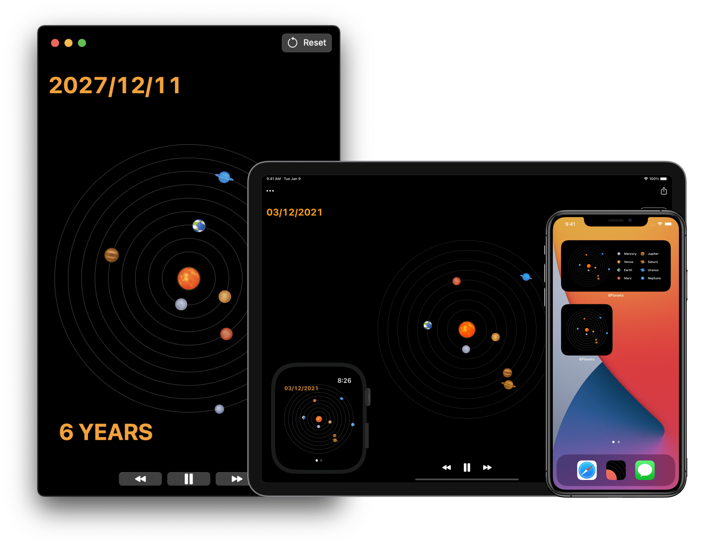

    
    <h1>8Planets</h1>
    
<b>8Planets</b> is a simple viewer and simulator for planetary orbits in our Solar System. It helps you discover <b>how the planets aligned and move around over time</b>. The apps are available on Mac, iPhone, iPad, and Apple Watch.

    
    
    
    

        
    

    
<i>💡 You can try 8Planets for free if you visit this site from your iOS device and tap “VIEW” from the top banner.</i>

    

        

            <h2>Planetary Motion</h2>
            
Speed up or slow down time to see how the planets rotate over time and grasp the scale of the Solar System.

        

        

            <h2>Time Travel</h2>
            
Travel back or forward in time to view the Solar System or planetary positions on any given date.

        

    

    

        

            <h2>Widgets</h2>
            
Widgets allow you to display the real-time Solar System on your iOS Home Screen and macOS Widgets for Notification Center.

        

        

            <h2>Watch</h2>
            
View the Solar System on your wrist and use Digital Crown to travel back or forward in time.

        

    

    

        

            <h2>And more...</h2>
            
Apple Watch Complications, Overview of the planets, Option to show Pluto, Sharing your favorite moment of the Solar System, URL Scheme, and more.

        

    

